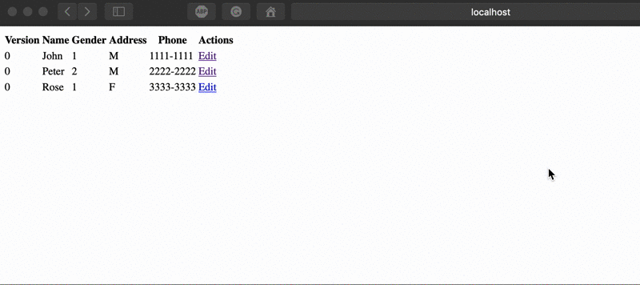
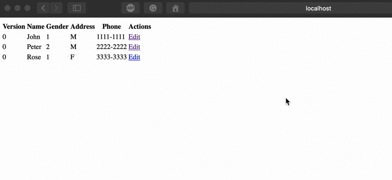

:numbered:

= Hibernate Concurrent Update and Quarkus Panache

This repository contains two maven projects that use an in-memory H2 database which is populated when the application starts. They use the `@Version` Hibernate's annotation to detect concurrent updates on the same entity,
according to issue https://github.com/quarkusio/quarkus/issues/7193[#7193]. 

The two projects are:

- link:1-database-concurrency-plain-hibernate[1-database-concurrency-plain-hibernate] - that uses Quarkus and plain Hibernate with the `@Version` annotation, working just as expected: `OptimisticLockException` is thrown when two users try to update the same entity.
- link:2-database-concurrency-panache[2-database-concurrency-panache] - uses Quarkus and Panache with the `@Version` annotation, but no `OptimisticLockException` is thrown.

== Running the projects

=== Quarkus and plain Hibernate

Inside the root directory of project link:1-database-concurrency-plain-hibernate[1-database-concurrency-plain-hibernate], type:

[source,bash]
----
./mvnw compile quarkus:dev
----

Then, open two browser tabs at http://localhost:8080/cliente.html?id=1 to update the same entity (simulating two concurrent users). Change something in each tab and click the "Send" button.

An `OptimisticLockException` will be thrown, as expected and shown below:

=== Quarkus and Panache

Run project link:2-database-concurrency-panache[2-database-concurrency-panache] using the same previous command and follow the same steps.

No `OptimisticLockException` will be thrown and the data on the previous update will be overwritten, as shown below:

